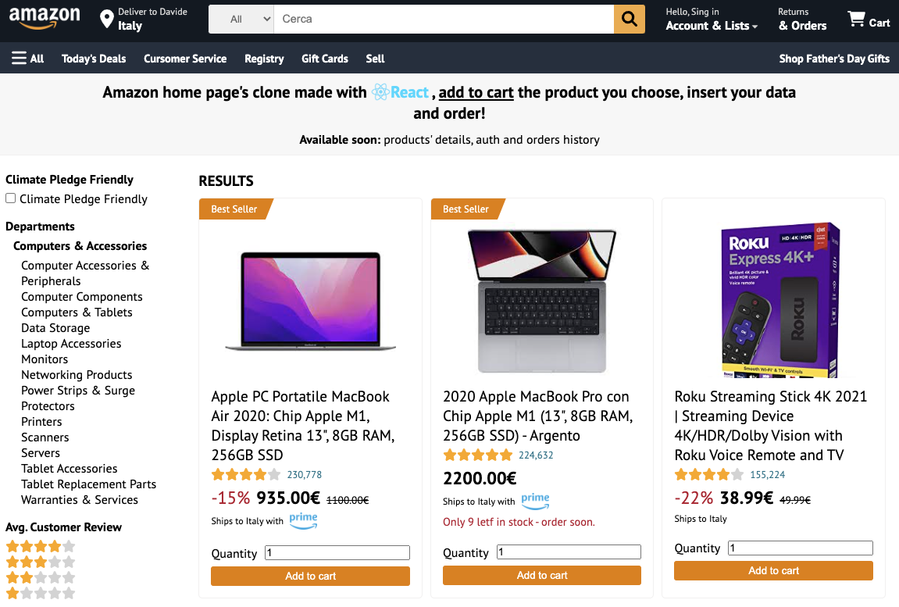

# React Amazon

## Description

- Amazon home page clone made with React, <u>add to cart</u> the product you choose, insert your data and order!
- Data is managed with react context and stored in firebase database.
 
Available soon: 
   - products' details, 
   - auth,
   - orders history 

 

--- File starting with ... are working in progress ---
 
 
## Install dependencies

`npm install`

## Start development server

`npm start`

 

## Screens

